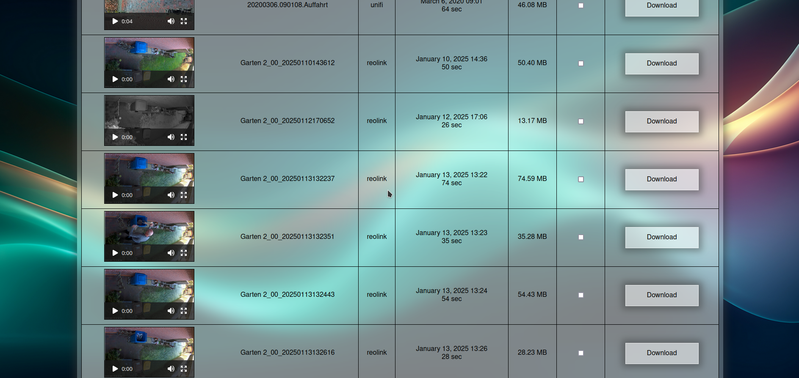

# Simple CCTV Player

**Early work in Progress. Come back later!**

A very simple webinterface to watch videos uploaded by surveillance cameras.
Most systems like Shinobi or Blue Iris need a lot of processing power.
In the meantime most video cameras can nowadays make object detection on their own and offer samba, NFS or FTP Uploads.
So we don't need to Process any video, we don't need to run local object detection. We can let the camera with the
optimized hardware do that.

So this will be a simple web interface to watch the recordings and cleanup old files. The cameras will do the hard work, and
we can use a very lightweight system like a raspberry zero.

Screenshot: (as everything, even the ui is in early development)  
